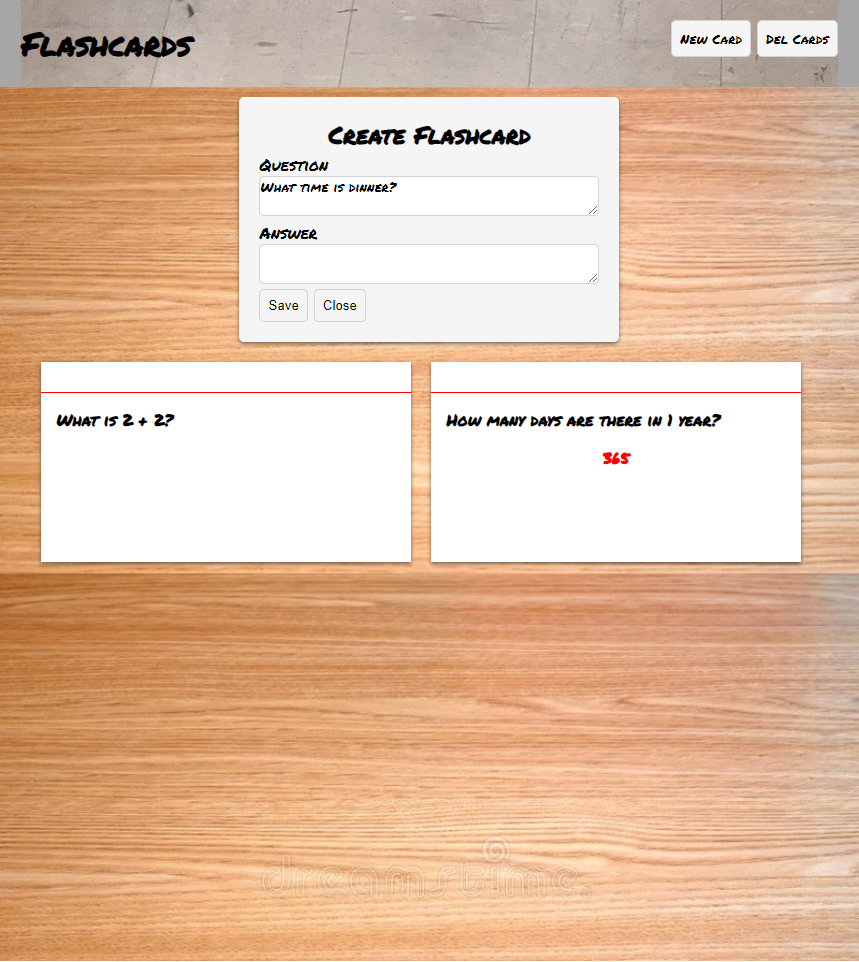

# JS-Flash-Cards

## <section id = "License">License</section>
 N/A
 
## <section id = "Description">Description</section>
Welcome to the Flash Card Creator Application! This application was built using HTML, CSS, and JavaScript, and allows users to create flash cards and save them to local storage. With this application, users can easily create flash cards for studying, memorization, or any other purpose. The user interface is designed to be intuitive and easy to use, so users can quickly create and save their flash cards. Thank you to Web Dev Tutorials, who created the tutorial on YouTube. Their tutorial provided invaluable guidance on the fundamentals of HTML, CSS, and JavaScript.

Tutorial by: Web Dev Tutorials   https://youtu.be/wtqbOFYivxw 
Link to application: https://cgotts1.github.io/JS-Flash-Cards/ 

## Table of Contents
1.) <a href = "#License">License</a> 
2.) <a href = "#Description">Description</a> 
3.) <a href = "#Installation">Installation</a>  
4.) <a href = "#Usage">Usage</a> 
5.) <a href = "#Contributing">Contributing</a> 
6.) <a href = "#Tests">Tests</a> 
7.) <a href = "#Questions">Questions</a>

## <section id = "Installation">Installation</section>
Command to Install Dependencies: N/A

## <section id = "Usage">Usage</section>
Using the Repo: N/A

## <section id = "Contributing">Contributing</section>
Contributing to the Repo: N/A

## <section id = "Tests">Tests</section>
Command to Run Tests: N/A

## <section id = "Questions">Questions</section>
If you have any questions, please feel free to contact me:   
1.) Github Username: Cgotts1  
2.) Email Address: cobi.gottschalk@gmail.com